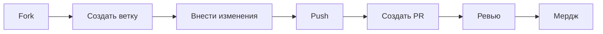

# Работа с GitHub

Руководство по использованию GitHub для управления документацией.

## Введение

GitHub - это не просто хранилище кода. Это мощная платформа для совместной работы над документацией с встроенными инструментами для ревью, автоматизации и публикации.

## Основные концепции

### Issues (Задачи)

Issues используются для:
- Отслеживания задач по документации
- Сообщения об ошибках в документах
- Предложений по улучшению

**Создание Issue:**

1. Перейдите на вкладку "Issues"
2. Нажмите "New Issue"
3. Заполните заголовок и описание
4. Добавьте labels (метки)
5. Назначьте ответственных

### Pull Requests (PR)

Pull Request - это предложение изменений в репозитории.

**Workflow:**



### Branches (Ветки)

Используйте ветки для изоляции работы:

```bash
# Главная ветка
main

# Ветки для документации
docs/add-installation-guide
docs/update-api-reference
docs/fix-typos
```

## Работа с Issues

### Создание Issue

```markdown
**Название**: Добавить руководство по установке Docker

**Описание**:
Нам нужно руководство по установке Docker для разных ОС.

**Требования**:
- [ ] Инструкции для macOS
- [ ] Инструкции для Linux
- [ ] Инструкции для Windows
- [ ] Примеры команд
- [ ] Скриншоты

**Labels**: documentation, enhancement
```

### Использование шаблонов

Создайте шаблон `.github/ISSUE_TEMPLATE/documentation.md`:

```markdown
---
name: Документация
about: Предложение по улучшению документации
title: '[DOCS] '
labels: documentation
---

## Описание
Что нужно добавить/изменить в документации?

## Предлагаемое решение
Как должен выглядеть обновленный документ?

## Дополнительный контекст
Любая дополнительная информация
```

## Pull Request Workflow

### 1. Создание ветки

```bash
# Обновите main
git checkout main
git pull origin main

# Создайте новую ветку
git checkout -b docs/add-docker-guide
```

### 2. Внесение изменений

```bash
# Создайте/отредактируйте файлы
code docs/guides/docker-installation.md

# Добавьте в Git
git add docs/guides/docker-installation.md

# Коммит
git commit -m "docs: add Docker installation guide"
```

### 3. Push и создание PR

```bash
# Отправьте ветку
git push -u origin docs/add-docker-guide
```

Затем на GitHub:
1. Откроется предложение создать PR
2. Заполните описание
3. Запросите ревью
4. Ждите обратной связи

### 4. Шаблон описания PR

```markdown
## Описание изменений

Добавлено руководство по установке Docker для macOS, Linux и Windows.

## Тип изменения

- [x] Новая документация
- [ ] Обновление существующей
- [ ] Исправление ошибок

## Чеклист

- [x] Проверены все ссылки
- [x] Примеры кода протестированы
- [x] Нет опечаток
- [x] Обновлена навигация в mkdocs.yml

## Связанные Issue

Closes #123

## Скриншоты (если применимо)


```

## GitHub Actions

### Автоматический деплой

Файл `.github/workflows/deploy-docs.yml` автоматически:
- Собирает документацию при push в main
- Деплоит на GitHub Pages
- Уведомляет о результате

### Проверка перед мерджем

```yaml
# .github/workflows/check-pr.yml
name: Check PR

on:
  pull_request:
    paths:
      - 'docs/**'

jobs:
  check:
    runs-on: ubuntu-latest
    steps:
    - uses: actions/checkout@v4
    
    - name: Setup Python
      uses: actions/setup-python@v5
      with:
        python-version: 3.x
    
    - name: Install dependencies
      run: pip install mkdocs-material
    
    - name: Build docs
      run: mkdocs build --strict
```

## GitHub Pages

### Настройка

1. **Settings** → **Pages**
2. **Source**: Deploy from a branch
3. **Branch**: `gh-pages`
4. **Folder**: `/` (root)

### Кастомный домен

В Settings → Pages → Custom domain:

```
docs.example.com
```

Создайте DNS записи:
```
CNAME docs.example.com username.github.io
```

## Коллаборация

### CODEOWNERS

Файл `.github/CODEOWNERS` определяет ответственных:

```
# Вся документация
/docs/ @username @team-docs

# API документация
/docs/reference/api.md @api-team

# Руководства для начинающих
/docs/getting-started/ @onboarding-team
```

### Ревью процесс

**Как reviewer:**

1. Проверьте изменения
2. Оставьте комментарии
3. Запросите правки или одобрите
4. Не мерджите без проверки

**Комментарии в PR:**

```markdown
# Общий комментарий
Отличная работа! Несколько замечаний ниже.

# Комментарий к строке кода
> Этот пример не работает на Windows
Нужно добавить инструкции для Windows.

# Предложение изменения
```suggestion
git clone https://github.com/user/repo.git
```
```

## Защита веток

Settings → Branches → Branch protection rules для `main`:

- ✅ Require pull request reviews before merging
- ✅ Require status checks to pass
- ✅ Require branches to be up to date
- ✅ Include administrators

## GitHub CLI

Установите [GitHub CLI](https://cli.github.com/) для работы из терминала:

```bash
# Создание Issue
gh issue create --title "Add Docker guide" --body "Need Docker installation guide"

# Создание PR
gh pr create --title "docs: add Docker guide" --body "Closes #123"

# Просмотр PR
gh pr view 42

# Мердж PR
gh pr merge 42

# Клонирование репозитория
gh repo clone username/documentation-artem
```

## Best Practices

### Коммит сообщения

```bash
# Хорошо
git commit -m "docs: add Docker installation guide"
git commit -m "docs: fix broken links in API reference"
git commit -m "docs: update screenshots in quickstart"

# Плохо
git commit -m "update"
git commit -m "fix stuff"
git commit -m "asdfasdf"
```

### Размер PR

- ✅ Маленькие, фокусированные PR
- ✅ Один PR = одна тема
- ❌ Избегайте больших рефакторингов
- ❌ Не смешивайте несвязанные изменения

### Ревью

- Ревьюйте быстро (в течение дня)
- Будьте конструктивны
- Предлагайте решения, не только критикуйте
- Хвалите хорошую работу

## Интеграция с другими сервисами

### Discord/Slack уведомления

Настройте webhook для уведомлений о новых PR и Issues.

### Confluence

Можно экспортировать документацию в Confluence через плагины.

## Метрики

Отслеживайте:
- Количество открытых/закрытых Issues
- Время ревью PR
- Частоту обновлений документации
- Покрытие документацией (% кода с docs)

## Полезные команды

```bash
# Посмотреть статус всех веток
git branch -a

# Удалить смерженные ветки
git branch --merged | grep -v "\*" | xargs -n 1 git branch -d

# Синхронизация fork с upstream
git fetch upstream
git checkout main
git merge upstream/main
git push origin main
```

## См. также

- [Git команды](../reference/git-commands.md)
- [Интеграция с Claude](claude-integration.md)
- [Быстрый старт](../getting-started/quickstart.md)

## Ресурсы

- [GitHub Docs](https://docs.github.com/)
- [GitHub Skills](https://skills.github.com/)
- [GitHub CLI Manual](https://cli.github.com/manual/)
